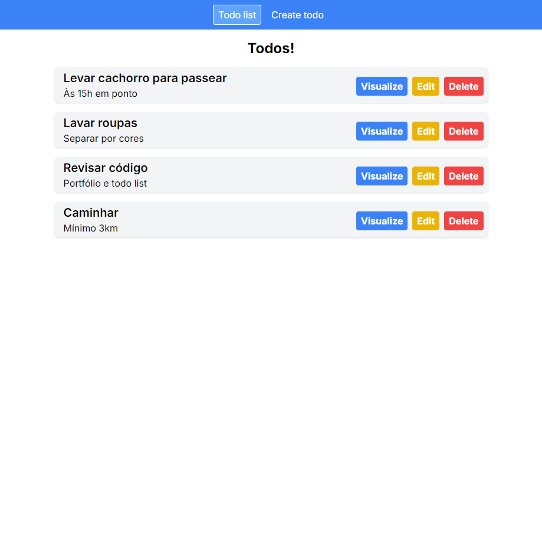
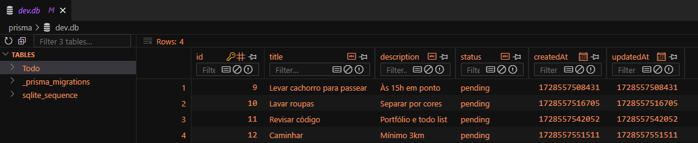
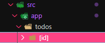
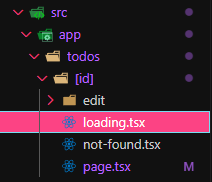

# Criação de tarefas (Todos) com Next.JS | Typescript



## Sumário

-  [Bibliotecas](#Bibliotecas)
   -  [Dependências](#dependências)
   -  [Dependências de desenvolvimento](#depêndencias-de-desenvolvimento)
-  [Imagens](#imagens)
-  [Objetivos](#objetivos)
-  [Passos iniciais](#passos-iniciais)
   -  [Configurações do Prisma](#configurações-do-prisma)
      -  [Configuração do Schema](#configuração-do-schema)
      -  [Migração dos dados para o banco](#migração-dos-dados-para-o-banco)
-  [Next](#next)
   -  [Formulário](#formulário)
   -  [Envio de dados ao banco](#envio-de-dados-ao-banco)
   -  [Consulta de dados no banco](#consulta-de-dados-no-banco)
   -  [Páginas dinâmicas e tratamento de páginas não encontradas](#páginas-dinâmicas-e-tratamento-de-páginas-não-encontradas)
   - [Loading](#loading)

## Bibliotecas

### Dependências

-  [@prisma/client](https://www.prisma.io/docs/orm/prisma-client): Biblioteca para conectar e realizar consultas ao banco de dados usando o ORM Prisma, simplificando o acesso a dados em aplicações Node.js e TypeScript.

### Dependências de desenvolvimento

-  [prisma](https://www.prisma.io/docs): ORM para gerenciar o esquema do banco de dados, fazer migrações e gerar automaticamente o cliente Prisma.
-  [TailwindCSS](https://tailwindcss.com): Framework CSS baseado em classes utilitárias para construir rapidamente interfaces personalizadas e responsivas.
-  [postcss](https://postcss.org): Ferramenta para processar CSS com plugins, permitindo otimizações, compatibilidade com navegadores e recursos futuros do CSS.
-  [prettier](https://prettier.io): Ferramenta de formatação de código que garante estilo consistente e legibilidade ao formatar automaticamente código JavaScript, TypeScript, HTML, CSS, entre outros.
-  [eslint](https://eslint.org): Ferramenta de linting que analisa o código em busca de erros e inconsistências de estilo, garantindo qualidade e padrões de código ajustados.

## Imagens

## Objetivos

-  Criar todos, criando-os e acessando-os ao banco de dados SQLite via Prisma
-  Deletar todos do banco de dados
-  Editar todos do banco de dados
-  Definir todos de "pendentes" para "concluidos"
-  Visualizar detalhes do todo
-  Tudo isso manipulando dados do banco utilizando Prisma via Next de forma simples.

## Passos Iniciais

### Configuração do Prisma

-  Utilizaremos prisma como nosso ORM
-  SQlite como banco de dados

dependências:

`npm i prisma @prisma/client`

-  Executar o prisma, para criação do esquema do banco de dados e a estrutura mínima do prisma

`npx prisma init`

#### Configuração do schema

```prisma
// 1
generator client {
  provider = "prisma-client-js"
}

// 2
datasource db {
  provider = "sqlite"
  url      = env("DATABASE_URL")
}

// 3
model Todo {
  id          Int      @id @default(autoincrement())
  title      String
  description   String?
  status      String   @default("pending") // Exemplos de status: "pendente", "concluído"
  createdAt   DateTime @default(now())
  updatedAt   DateTime @updatedAt
}
```

1. Configuração do gerador do código Prisma Client, que permite interagir com nosso banco de dados. Além disso, o `provider` especifica que o Prisma Client usará JavaScript para gerar o código
2. Define a fonte de dados que o prisma vai usar, chamda `db`. O provedor/banco de dados será o `sqlite` e a definição da URL de conexão com o banco, coletando essa informação diretamente da variável de ambiente
3. Definição do modelo "Todo" (Nome da tabela), separando os dados como integer, string, date etc.
   -  O id, definido por `@id` representa uma chave primária que recebe um auto incremento `(autoincrement())`.
   -  A descrição é uma string opcional, definida pelo `?`.
   -  Os dados que recebem o decorator `@default`no Prisma define que se nenhum valor for fornecido para aquele campo, ele será automaticamente preenchido pelo valor definido entre chaves. Exemplo, o status por padrão será definido como uma string _"pending"_.

#### Migração dos dados para o banco

A url do nosso banco deve ser definida no arquivo `.env` na raiz do projeto. Em outras situações, deveríamos colocar a url do banco, mas aqui a termos de estudos vamos criar diretamente na aplicação. Então o caminho definido é o caminho do arquivo no projeto:

```env
DATABASE_URL="file:./dev.db"
```

Após criação do schema, é necessário enviá-lo para o banco com o comando:

`npx prisma migrate dev`

O arquivo criado é um sqlite, então você pode baixar a extensão `SQLITE Viewer` no VSCode para que o código fique visível assim:



## Next

Primeiramente criar um cabeçalho que redirecionará o usuário para página de criação de usuários e a página com a lista de Todos registrados.

```tsx
import Link from "next/link";

const Header = () => {
   return (
      <header className="...">
         <nav className="...">
            <Link href="/" className="...">
               Todo list
            </Link>
            <Link href="/todos/create" className="...">
               Create todo
            </Link>
         </nav>
      </header>
   );
};

export default Header;
```

Usando o componente `<Link>` nativo do Next, ele agirá como um `React Router Dom`, redirecionando o usuário para a rota definida. Como toda nossa aplicação terá um cabeçalho, este componente pode ser adicionado ao arquivo raiz da aplicação no `src/app/layout.tsx`

```tsx
return (
   <html lang="en">
      <body className={inter.className}>
         <Header />
         {children}
      </body>
   </html>
);
```

O Next utiliza o conceito de roteamento baseado em arquivos, assim como orientado na rota **"/todos/create"** só precisamos criar uma pasta dentro de app com os nomes correspondentes assim `src/app/todos/create/page.tsx` e todo arquivo `page.tsx` será um caminho de rota.

### Formulário

No Next.js, "use client" e "use server" são diretivas que indicam onde o código será executado, no cliente (navegador) ou no servidor. Elas ajudam a definir o comportamento de componentes no ambiente de renderização do Next.js. No caso de formulários, as funções chamadas em suas actions devem utilizar a diretiva "use server", portanto a função deve estar em um arquivo a parte utilizando _"use server"_ no topo do arquivo ou dentro do escopo da função.

```tsx
const TodoPage = () => {
   return (
      <div className="...">
         <h1 className="...">Create a new todo</h1>
         <form action={handleAddTodo} className="...">
            {/*inputs do formulário*/}
         </form>
      </div>
   );
};
```

Como action utilizamos a função `handleAddTodo` que vai lidar com os dados do formulário e enviá-los ao banco de dados. Essa função será executada quando os dados forem enviados após preenchimento do formulário.

```tsx
export const handleAddTodo = async (formData: FormData) => {
   "use server";

   console.log(formData); // Aqui recebemos os dados do formulário quando a função for executada após envio.
};
```

### Envio de dados ao banco

Para enviarmos os dados para o banco precisamos de um arquivo com **acesso ao Client do Prisma**, que nos permitirá fazer operações com o banco.

Deixar client do prisma isolado em um arquivo a parte. Criar o arquivo `src/db.ts`:

```ts
import { PrismaClient } from "@prisma/client";
export const db = new PrismaClient();
```

Agora podemos realizar operações no banco de dados dentro da nossa função `handleAddTodo`

```tsx
// 1
export const handleAddTodo = async (formData: FormData) => {
   // 2
   const formTitle = formData.get("title");
   const formDescription = formData.get("description");
   const status = "pending";

   // 3
   const title = typeof formTitle === "string" ? formTitle : "";
   const description =
      typeof formDescription === "string" ? formDescription : "";

   // 4
   await db.todo.create({
      data: {
         title,
         description,
         status,
      },
   });

   // 5
   redirect("/");
};
```

1. O `formData` no Next é uma interface JavaScript usada para construir e manipular os dados enviados por um formulário, no caso, os valores preenchidos nos inputs do formulário.
2. Desestruturação dos dados do formulário. o método `get()` do `formData` coleta os dados de acordo com `name` do campo. Exemplo:

```tsx
<input type="text" name="title" />
```

-  Então para coletarmos os dados deste campo no formulário usamos o `formData.get("title")`.

3. Conferências exigidas pelo typescript, para garantir que os valores recebidos não são nulos antes de adicioná-los ao banco. Aqui também poderíamos fazer validações dos campos, como conferência de número de caracteres, preenchimento válido dos campos, etc, antes de registrá-los ao banco.

4. db é o banco de dados, agora podemos realizar operações nele. `db.todo` é o nome da nossa tabela e o método `.create` seria como uma requisição HTTP `POST`, para adição de dados ao banco, que recebe um objeto com o valor `data`, que é o objeto com os campos da tabela.

   -  Dessa forma, só precisamos definir o valor que cada campo do banco deve ter, definindo o `title`, `description` e `status`.
   -  O status já é definido como default, como criamos no nosso schema, mas adicionamos, não há problema.

5. Método do `next/navigation` para redirecionar o usuário para alguma página após conclusão da função.

### Consulta de dados no banco

-  Para resgatar os dados recisamos mudar a função do componente para assíncrona

-  O método findMany é p responsável por renderizar todos os dados na tabela usando Prisma e utilizamos o método map para renderizá-los no componente.

```tsx
// outras importações
import { db } from "@/db"; // importação do banco de dados

// Transformar nossa função em async
export default async function Home() {
   const todos = await db.todo.findMany(); // coletando TODOS os dados do banco

   return (
      <main>
         <h1>Todos!</h1>
         <div>
            {todos.map((todo) => (
               <div key={todo.id}>
                  {/* Renderização dos dados do do banco */}
               </div>
            ))}
         </div>
      </main>
   );
}
```

As ações deste componente vamos trata-las a parte:

```tsx
<div>
   <Link href={`/todos/${todo.id}`}>Visualize</Link>
   <Link href={`/todos/${todo.id}/edit`}>Edit</Link>
   <form action={handleDeleteTodo}>
      <input type="hidden" name="id" value={todo.id} />
      <Button>Delete</Button>
   </form>
</div>
```

1. Adicionamos dois botões que nos levarão para a visualização e edição do todo e nessas páginas teremos acesso ao id do todo
2. O botão de `delete` usamos um formulário com um input escondido `type="hidden"` que quando ele é enviado por este nosso componente de `<Button>` o valor do id é enviado via `formData` para função responsável por deletar o todo.

**handleDeleteTodo**

Esta função está no nosso arquivo `src/actions.ts`, responsável por todas as ações do nosso banco de dados, e ele é estrytyradi assim:

```ts
export const handleDeleteTodo = async (formData: FormData) => {
   // 1
   const id = Number(formData.get("id"));

   // 2
   await db.todo.delete({
      where: { id },
   });

   // 3
   redirect("/");
};
```

Coletamos o id do formData, coletando o valor do campo de nome `id`e já o envolvemos no método `Number()`, pois ele nos é enviado como uma string, mas precisamos de um `number` para utiliza-lo no banco. 2. usamos o método `.delete` do banco, onde o dado possui o id que recebemos e assim será excluido do banco de dados. 3. Usuário redirecionado para tela inicial.

### Páginas dinâmicas e tratamento de páginas não encontradas

-  Para criar a rota dinâmica dos `todos` individuais vamos utilizar páginas dinâmicas do Next. Consiste em criar uma pasta com um valor que é único e variável no item, por exemplo o id;
-  Então a pasta terá o nome `[id]`, com um arquivo `page.js` dentro.



-  Este dado dinâmico chega via props ao componente.
-  Na página podemos utilizar o método findFirst do Prisma, e encontrar registro que estamos buscando com o `id` que recebemos via `props`.

```tsx
import { findTodoById } from "@/actions"; // 1
import { notFound } from "next/navigation"; // 2

interface IShowTodo {
   params: {
      id: string;
   };
}

const ShowTodo: React.FC<IShowTodo> = async ({ params }) => {
   const id: number = Number(params.id);
   // Caso o id seja inválido, retornamos a função notFound();
   if (Number.isNaN(id)) return notFound();

   const currentTodo = await findTodoById(id);

   // Validações para verificar se este dado existe
   if (!currentTodo) return notFound();
   return <div>{/*Renderização dos dados usando o currentTodo*/}</div>;
};
```

1. Função responsável por usar o id e buscar os dados do `todo` no banco. Vamos abordá-lo em breve.
2. Em Next.js, a função `notFound()` é da biblioteca `next/navigation`, assim o framework redireciona o usuário para a página de erro 404 personalizada (ou a página 404 padrão) do seu projeto.
   -  Aqui só é necessário criar um arquivo na mesma pasta chamado `not-found.tsx` e se a função `notFound()` for executada o usuário é redirecionado para essa página onde você deve customizar e criar.

A função `findoTodoById` é uma consulta simples ao banco que coleta os dados do `todo` pelo seu id:

```ts
export const findTodoById = async (id: number) => {
   const todo = await db.todo.findFirst({
      where: { id },
   });

   return todo;
};
```

O método `findFirst()` basicamente retorna o primeiro registro que atenda ao parâmetro exigido, no caso, o `id` que é único. Assim somente um dado é retornado.

### Loading

Da mesma forma que podemos usar páginas dinâmicas colocando o nome dos arquivos como `page.tsx` ou `not-found.tsx` podemos criar o mesmo para o arquivo `loading.tsx` que será automaticamente renderizado quando a página estiver sob algum carregamento.

Na nossa aplicação não estamos lidando com renderização de servidores, portanto podemos simular essa ação utilizando o `setTimeOut`.

```tsx
const ShowTodo: React.FC<IShowTodo> = async ({ params }) => {
   await new Promise((a) => setTimeout(a, 2000));
```

Se o banco precisar de um tempo para renderizar o retorno do componente, enquanto este carregamento ocorre, o componente loading é executado:



